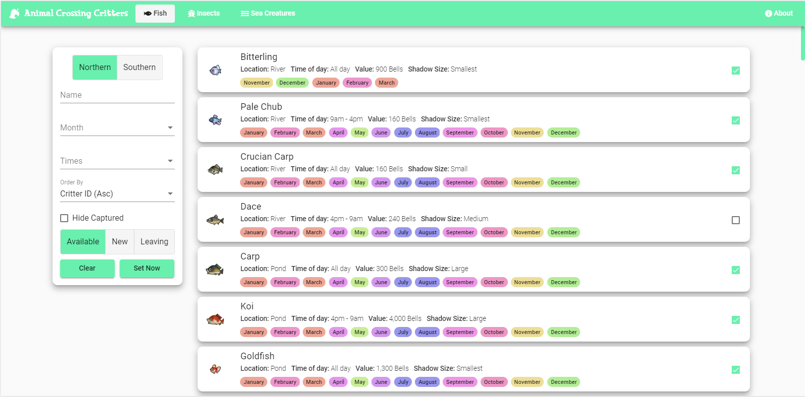

# Animal Crossing Critters

This webapp was designed to help Animal Crossing: New Horizons players keep track of the critters they have captured and what critters are available at any given time. The initial data used on this webapp was collected from various sources around the internet and was parsed into json objects that I could manipulate easily. This json file was then ran through the DataParser project in this repository to manipulate some of the collected fields into objects that I wanted to use in on the webapp. The Parser project was created in C# and was meant to be a quick and simple data manipulator without much hassle. The actual webapp was developed using the angular 8 framework and implements a material UI design. 

This webapp is hosted on AWS Amplify and can be reached by navigating to https://animalcrossing.scavettapps.com



## Running the webapp locally

To run the webapp locally, download the source code and run the following commands inside the AnimalCrossingTracker folder

```sh
npm install -g @angular/cli
npm install
ng serve
```

## Release History
* 1.3.0
    * Added a new page for the newly added Sea Creatures
    * Changed hosting and automated build provider from Heroku to AWS Amplify
    * Renamed the 'Bugs' button and route to 'Insects' to reflect the game's language.
    * Added a loading spinner while the data is being fetched
    * Upgraded the angular version from 8.2 -> 10.0
    * Refactored some of the generic display code to be more generic
    * Updated the versioning scheme
* 0.2.0
    * Added the ability to order critters by either their id or their value
    * Minor refactoring to cleanup some of the code
* 0.1.1
    * Filters now save in local storage so that they are remembered between pages and sessions
    * Addition of new filters to narrow into specific critters
    * Fixed some images for certain bugs that were broken on mobile
    * Adding new images for missing bugs.
* 0.1.0
    * Initial deployment of the webapp

## Copyright

Vincent Scavetta – [@scavettapps](https://twitter.com/scavettapps) – scavettapps@gmail.com

## Contributing

1. Fork it (<https://github.com/scavet64/AnimalCrossingCritters/fork>)
2. Create your feature branch (`git checkout -b feature/fooBar`)
3. Commit your changes (`git commit -am 'Add some fooBar'`)
4. Push to the branch (`git push origin feature/fooBar`)
5. Create a new Pull Request